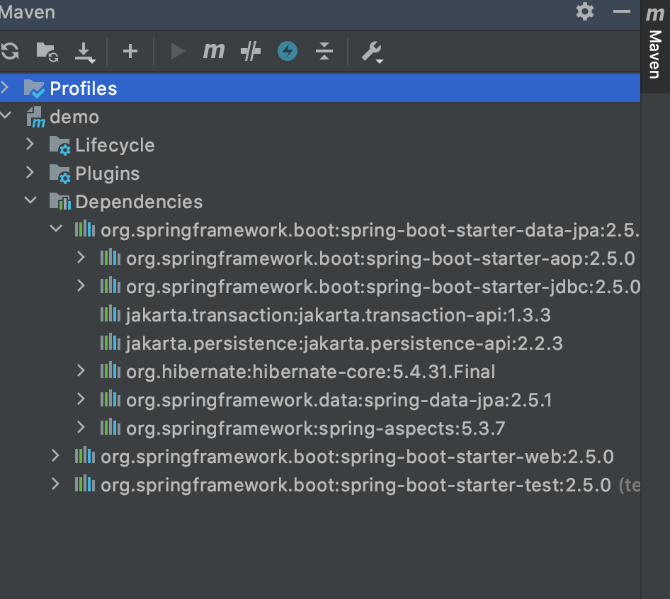

# HW2
## 1 – IOC and DI means?

In software engineering, inversion of control (IoC) is a programming principle. IoC inverts the flow of control as compared to traditional control flow. In IoC, custom-written portions of a computer program receive the flow of control from a generic framework. A software architecture with this design inverts control as compared to traditional procedural programming: in traditional programming, the custom code that expresses the purpose of the program calls into reusable libraries to take care of generic tasks, but with inversion of control, it is the framework that calls into the custom, or task-specific, code.

Advantages:

- decoupling the execution of a task from its implementation
- making it easier to switch between different implementations
- greater modularity of a program
- greater ease in testing a program by isolating a component or mocking its dependencies, and allowing components to communicate through contracts

In software engineering, dependency injection is a design pattern in which an object or function receives other objects or functions that it depends on. A form of inversion of control, dependency injection aims to separate the concerns of constructing objects and using them, leading to loosely coupled programs. The pattern ensures that an object or function which wants to use a given service should not have to know how to construct those services. Instead, the receiving 'client' (object or function) is provided with its dependencies by external code (an 'injector'), which it is not aware of. Dependency injection helps by making implicit dependencies explicit and helps solving the following problems. 

## 2 – Spring Bean Scopes?

The scope of a bean defines the life cycle and visibility of that bean in the contexts we use it. In Spring, bean scope is used to decide which type of bean instance should be returned from Spring container back to the caller. The latest version of the Spring framework defines 6 types of scopes:
- ### Singleton 

When we define a bean with the singleton scope, the container creates a single instance of that bean; all requests for that bean name will return the same object, which is cached. Any modifications to the object will be reflected in all references to the bean. This scope is the default value if no other scope is specified.
- ### Prototype

A bean with the prototype scope will return a different instance every time it is requested from the container. It is defined by setting the value prototype to the @Scope annotation in the bean definition.
- ### Request (in web aware scopes)

A request-scoped bean is an object managed by Spring, for which the framework creates a new instance for every HTTP request. The app can use the instance only for the request that created it. Any new HTTP request (from the same or other clients) creates and uses a different instance of the same class.

- ### Session (in web aware scopes)

Beans instantiated based on session scope lives through the HTTP session. Similar to request scope, it is applicable only for web aware spring application contexts. You use spring session beans for beans which are stateful and their state differs per user. These can be for example preferences of currently logged in user. Default scope of bean in spring is singleton and it is no different in Web Application context.
- ### Application (in web aware scopes)

The application scope creates the bean instance for the lifecycle of a Servlet Context. This is similar to the singleton scope, but there is a very important difference with regards to the scope of the bean. When beans are application scoped, the same instance of the bean is shared across multiple servlet-based applications running in the same Servlet Context, while singleton scoped beans are scoped to a single application context only.
- ### Websocket (in web aware scopes)

This scope is used when two-way communication between a customer and remote site is enabled using the websocket protocol. It is mainly useful when applications are used by multiple users with simultaneous actions. Here, an HTTP request is used to do an initial handshake, and once it is established, the TCP port remains open for a client and server for communication. The websocket bean is similar to a singleton, and injected into Spring controllers. The life of a websocket bean is longer compared to a typical websocket session.

## 3 – What does @SpringBootApplication do?

Spring Boot is a project that is built on the top of the Spring Framework. It provides an easier and faster way to set up, configure, and run both simple and web-based applications. It is a Spring module that provides the RAD (Rapid Application Development) feature to the Spring Framework. It is used to create a stand-alone Spring-based application that you can just run because it needs minimal Spring configuration.

## 4 – Why Spring Boot over Spring?

Spring Boot is basically an extension of the Spring framework, which eliminates the boilerplate configurations required for setting up a Spring application. Some of the advantages of Spring Boot over Spring in the context of deployment include:
- Provides embedded container support
- Provision to run the jars independently using the command java -jar
- Option to exclude dependencies to avoid potential jar conflicts when deploying in an external container
- Option to specify active profiles when deploying
- Random port generation for integration tests

Differences between Spring and Spring Boot:


## 5 – What is Singleton and where to use it?

Singleton pattern is a design pattern which restricts a class to instantiate its multiple objects. It is nothing but a way of defining a class. Class is defined in such a way that only one instance of the class is created in the complete execution of a program or project. It is used where only a single instance of a class is required to control the action throughout the execution. A singleton class shouldn’t have multiple instances in any case and at any cost. Singleton classes are used for logging, driver objects, caching and thread pool, database connections.

## 6 – Explain @RestController annotation in Sprint boot?

RestController is used for making restful web services with the help of the @RestController annotation. This annotation is used at the class level and allows the class to handle the requests made by the client. The RestController allows to handle all REST APIs such as GET, POST, Delete, PUT requests.

## 7 - What is the primary difference between Spring and Spring Boot?


## 8 – Why to use VCS?

Version control, also known as source control, is the process of tracking and managing changes to files over time. VCS (version control systems) are software tools designed to help teams work in parallel. Version control systems allow multiple developers, designers, and team members to work together on the same project. It helps them work smarter and faster. A version control system is critical to ensure everyone has access to the latest code and modifications are tracked.

## 9 – What are SOLID Principles? Give sample usages in Java?

The SOLID Principles are five principles of Object-Oriented class design. They are a set of rules and best practices to follow while designing a class structure.
The SOLID principles were first introduced by the famous Computer Scientist Robert J. Martin (a.k.a Uncle Bob) in his paper in 2000. But the SOLID acronym was introduced later by Michael Feathers. Uncle Bob is also the author of bestselling books Clean Code and Clean Architecture, and is one of the participants of the "Agile Alliance". Therefore, it is not a surprise that all these concepts of clean coding, object-oriented architecture, and design patterns are somehow connected and complementary to each other. They all serve the same purpose: "To create understandable, readable, and testable code that many developers can collaboratively work on." Following the SOLID acronym, they are:

- ### The Single Responsibility Principle
The Single Responsibility Principle states that a class should do one thing and therefore it should have only a single reason to change.
````
import java.io.*;
import java.util.*;
  
class GFG {
    public static void main(String[] args)
    {
        Customer customer1 = new Customer();
        customer1.setName("John");
        customer1.setAddress("Pune");
        Order order1 = new Order();
        order1.setItemName("Pizza");
        order1.setQuantity(2);
        order1.setCustomer(customer1);
  
        order1.prepareOrder();
  
        BillCalculation billCalculation
            = new BillCalculation(order1);
        billCalculation.calculateBill();
  
        DeliveryApp deliveryApp = new DeliveryApp(order1);
        deliveryApp.delivery();
    }
}
  
class Customer {
    private String name;
    private String address;
    public String getName() { return name; }
    public void setName(String name) { this.name = name; }
    public String getAddress() { return address; }
    public void setAddress(String address)
    {
        this.address = address;
    }
}
  
class Order {
  
    private Customer customer;
    private String orderId;
    private String itemName;
    private int quantity;
    private int totalBillAmt;
  
    public Customer getCustomer() { return customer; }
    public void setCustomer(Customer customer)
    {
        this.customer = customer;
    }
    public String getOrderId() { return orderId; }
    public void setOrderId(String orderId)
    {
        Random random = new Random();
  
        this.orderId = orderId + "-" + random.nextInt(500);
    }
    public String getItemName() { return itemName; }
    public void setItemName(String itemName)
    {
        this.itemName = itemName;
        setOrderId(itemName);
    }
    public int getQuantity() { return quantity; }
    public void setQuantity(int quantity)
    {
        this.quantity = quantity;
    }
    public int getTotalBillAmt() { return totalBillAmt; }
    public void setTotalBillAmt(int totalBillAmt)
    {
        this.totalBillAmt = totalBillAmt;
    }
  
    public void prepareOrder()
    {
        System.out.println("Preparing order for customer -"
                           + this.getCustomer().getName()
                           + " who has ordered "
                           + this.getItemName());
    }
}
  
class BillCalculation {
  
    private Order order;
    public BillCalculation(Order order)
    {
        this.order = order;
    }
  
    public void calculateBill()
    {
        /* In the real world, we would want a kind of lookup
          functionality implemented here where we look for
          the price of each item included in the order, add
          them up and add taxes, delivery charges, etc on
          top to reach the total price. We will simulate
          this behaviour here, by generating a random number
          for total price.
        */
        Random rand = new Random();
        int totalAmt
            = rand.nextInt(200) * this.order.getQuantity();
  
        this.order.setTotalBillAmt(totalAmt);
        System.out.println("Order with order id  "
                           + this.order.getOrderId()
                           + " has a total bill amount of "
                           + this.order.getTotalBillAmt());
    }
}
  
class DeliveryApp {
  
    private Order order;
    public DeliveryApp(Order order) { this.order = order; }
  
    public void delivery()
    {
        // Here, we would want to interface with another
        // system which actually assigns the task of
        // delivery to different persons
        // based on location, etc.
        System.out.println("Delivering the order");
        System.out.println(
            "Order with order id as "
            + this.order.getOrderId()
            + " being delivered to "
            + this.order.getCustomer().getName());
        System.out.println(
            "Order is to be delivered to: "
            + this.order.getCustomer().getAddress());
    }
}
````
````
Output 
Preparing order for customer -John who has ordered Pizza
Order with order id  Pizza-57 has a total bill amount of 46
Delivering the order
Order with order id as Pizza-57 being delivered to John
Order is to be delivered to: Pune
````
We have a Customer class that has customer attributes like name, address. Order class has all order information like item name, quantity.

The BillCalculation class calculates the total bill sets the bill amount in the order object. The DeliveryApp has 1 task of delivering the order to the customer. In the real world, these classes would be more complex and might require their functionality to be further broken down into multiple classes.

For example, the bill calculation logic might require some kind of lookup functionality to be implemented where we look for the price of each item included in the order against some kind of database, add them up, add taxes, delivery charges, etc and finally reach the total price. Depending on how complex the code starts to become, we might want to move the taxes, database queries etc, to other separate classes. Similarly, the delivery class might want to interface with another task management system that actually assigns the task of delivery to different delivery agents based on location, shift timings, whether that delivery person has actually shown up to work, etc. These individual steps could move to separate classes when they need specialized handling.

If the functionality of bill calculation, as well as order delivery, was added in the same class, then that class gets modified whenever the bill calculation logic or the delivery agent logic needs to change; which goes against the Single Responsibility Principle.  As per the example, we have a separate class for handling each of these functions. Any single business requirement change should ideally have an impact on only one class, thus catering to the Single Responsibility Principle.
- ### The Open-Closed Principle
The Open-Closed Principle requires that classes should be open for extension and closed to modification.

Example :

Program to calculate the volume in which let us consider the task of building an application that calculates the volumes of all the geometric objects.

- The Cuboid class stores dimensions of the cuboid
- Later on, the Application class calculates the total volume of the geometric objects–which are only cuboids currently.
- Run class helps to run the whole program.
````
// Java Program to illustrate Open Closed Principle
 
// Class 1
// Helper class
// To store dimensions of a cuboid
// length, breadth and height
class Cuboid {
     
    // Member variables
    public double length;
    public double breadth;
    public double height;
}
 
// Class 2
// Helper class
// To calculate the volume of geometric objects
class Application {
 
    // It returns the total volume of the geometric objects
    public double get_total_volume(Cuboid[] geo_objects)
    {
        // Variable to store total volume
        double vol_sum = 0;
 
        // Iteratively calculating the volume of each object
        // and adding it to the total volume
        for (Cuboid geo_obj : geo_objects) {
             
            // Iteratively calculating the volume of each object
            // and adding it to the total volume
            vol_sum += geo_obj.length * geo_obj.breadth
                       * geo_obj.height;
        }
 
        // returning the to total volume
        return vol_sum;
    }
}
 
// Class 3
// Main Class
// To demonstrate working of all classes
public class GFG {
 
    // Main driver method
    public static void main(String args[])
    {
        // Initializing a cuboid one & declaring dimensions by
        // creating an object of Cuboid class in main() method
        Cuboid cb1 = new Cuboid();
 
        // Custom entries
        cb1.length = 5;
        cb1.breadth = 10;
        cb1.height = 15;
 
        // Similarly, initializing a cuboid2 and declaring dimensions
        // by creating object of Cuboid class in the man() method
        Cuboid cb2 = new Cuboid();
 
        // Custom entries
        cb2.length = 2;
        cb2.breadth = 4;
        cb2.height = 6;
 
        // Initializing a cuboid3 and declaring dimensions by
        // creating object of Cuboid class in the main() method
        Cuboid cb3 = new Cuboid();
 
        // Custom entries
        cb3.length = 3;
        cb3.breadth = 12;
        cb3.height = 15;
 
        // Now, declaring andinitializing Array of cuboids
        Cuboid[] c_arr = new Cuboid[3];
        c_arr[0] = cb1;
        c_arr[1] = cb2;
        c_arr[2] = cb3;
 
        // Initializing the Application class
        Application app = new Application();
         
        // Getting the total volume
        // using get_total_volume
        double vol = app.get_total_volume(c_arr);
         
        // Print and Display the Total Volume
        System.out.println("The total volume is " + vol);
    }
}
````
````
Output 
The total volume is 1338.0
````
Now, lets say the customer wants the application to calculate the volume of a sphere as well. In order to accommodate new type of geometric object, the application also needs to be changed.
````
// Java Program to illustrate Open Closed Principle
 
// class 1
// Helper class
// To store dimensions of a cuboid
// used to store length, breadth and height of a cuboid
class Cuboid {
 
    // Member variables of this class
    public double length;
    public double breadth;
    public double height;
}
 
// Class 2
// Helper class
// To store dimensions of a sphere
class Sphere {
 
    // Storing radius of a sphere
    public double radius;
}
 
// Class 3
// Helper class
// This class helps to calculate the volume of geometric
// objects
class Application {
 
    // Returning the total volume of the geometric objects
    public double get_total_volume(Cuboid[] c_geo_objects,
                                   Sphere[] s_geo_objects)
    {
        // Variable used to store total volume
        double vol_sum = 0;
 
        // Iteratively calculating the volume of each Cuboid
        // and adding it to the total volume
 
        // Iterating using for each loop to
        // calculate the volume of a cuboid
        for (Cuboid geo_obj : c_geo_objects) {
 
            vol_sum += geo_obj.length * geo_obj.breadth
                       * geo_obj.height;
        }
 
        // Iterating using for each loop to
        // calculate the volume of a cuboid
        for (Sphere geo_obj : s_geo_objects) {
 
            // Iteratively calculating the volume of each
            // Sphere and adding it to the total volume
            vol_sum += (4 / 3) * Math.PI * geo_obj.radius
                       * geo_obj.radius * geo_obj.radius;
        }
 
        // Returning the to total volume
        return vol_sum;
    }
}
 
// Class 4
// Main class
// To demonstrate working of all classes
public class GFG {
 
    //  Main driver method
    public static void main(String args[])
    {
        // Initializing a cuboid one as well as declaring
        // its dimensions.
        Cuboid cb1 = new Cuboid();
        cb1.length = 5;
        cb1.breadth = 10;
        cb1.height = 15;
 
        // Initializing a cuboid two as well as declaring
        // its dimensions.
        Cuboid cb2 = new Cuboid();
        cb2.length = 2;
        cb2.breadth = 4;
        cb2.height = 6;
 
        ////Initializing a cuboid three as well as declaring
        /// its dimensions.
        Cuboid cb3 = new Cuboid();
        cb3.length = 3;
        cb3.breadth = 12;
        cb3.height = 15;
 
        // Initializing and declaring an array of cuboids
        Cuboid[] c_arr = new Cuboid[3];
        c_arr[0] = cb1;
        c_arr[1] = cb2;
        c_arr[2] = cb3;
 
        // Initializing a sphere one as well as declaring
        // its dimension.
        Sphere sp1 = new Sphere();
        sp1.radius = 5;
 
        // Initializing a sphere two as well as declaring
        // its dimension.
        Sphere sp2 = new Sphere();
        sp2.radius = 2;
 
        // Initializing a sphere three as well as declaring
        // its dimension.
        Sphere sp3 = new Sphere();
        sp3.radius = 3;
 
        // Initializing and declaring an array of spheres
        Sphere[] s_arr = new Sphere[3];
        s_arr[0] = sp1;
        s_arr[1] = sp2;
        s_arr[2] = sp3;
 
        // Initializing Application class
        Application app = new Application();
 
        // Getting the total volume
        // using get_total_volume
        double vol = app.get_total_volume(c_arr, s_arr);
 
        // Print and display the total volume
        System.out.println("The total volume is " + vol);
    }
}
````
````
Output 
The total volume is 1840.6548245743668
````
As we can see the application class had to be changed to accommodate the sphere. Any changes in a code can lead to some unexpected errors in the future–so it is not advisable to change the well-tested code every time requirements change. Let’s try to apply the Open Close principle and see if we can add a sphere (a new type of object) without making any changes to the application class.

Solution:

- Create an abstract class that serves as a base class for all types of objects.
- All the geometric objects have a set of dimensions and a get_volume method (both of which are different for each type of object).
- For each type of object (a geometric object in this case) inherit the ‘Geo_object’ class, add the dimensions for that type of object and override the ‘get_volume‘ method.
- As it is apparent that by shifting the volume calculation from the ‘Application’ class to a different class, adding a new type of geometric object would not require changing the ‘Application’ class.
````
// Java Program to illustrate Open Closed Principle
 
// Importing all classes from java.math package
// to compute mathematic calculations
import java.math.*;
 
// Class 1
// Helper Class
// Abstract class--which needs to be extended
abstract class Geo_objects {
 
   // Abstract function--which needs to overriden
    public abstract double get_volume();
}
 
// Class 2
// Helper Class
// Extending the Geo_objects to fit cuboid dimensions
class Cuboid_2 extends Geo_objects {
     
    // used to store length, breadth and height of a cuboid
 
    public double length;
    public double breadth;
    public double height;
 
    // overrided function to calculate
    // the volume of a cuboid
    // @Override
    public double get_volume()
    {
        return length * breadth * height;
    }
}
 
// Class 3
// Helper Class
// Extending Geo_objects to fit sphere dimension
 class Sphere_2 extends Geo_objects {
     
    // To store radius of a sphere
    public double radius;
 
    // Overrided function to calculate
    //  the volume of a sphere
     
    //@Override
    public double get_volume()
    {
        return (4 / 3) * Math.PI * radius * radius * radius;
    }
}
 
// Class 4
// Helper class
// To calculate the volume of geometric objects
class Application {
 
    public double
        get_total_volume(Geo_objects[] geo_objects)
    {
        // Initially initializing sum to zero
        double vol_sum = 0;
 
        // Iterating using for each loop
        for (Geo_objects geo_obj : geo_objects) {
            vol_sum += geo_obj.get_volume();
        }
  
        return vol_sum;
    }
}
 
// Class 5
// Main class
// To demonstrate working of all classes
public class GFG {
 
    // Main driver method
    public static void main(String args[])
    {
        // Initializing cuboid1 as well as declaring
        // its dimensions.
        Cuboid_2 cb1 = new Cuboid_2();
 
        // Custom entries
        cb1.length = 5;
        cb1.breadth = 10;
        cb1.height = 15;
 
        // Initializing Cuboid2 as well as declaring
        // its dimensions.
        Cuboid_2 cb2 = new Cuboid_2();
        cb2.length = 2;
        cb2.breadth = 4;
        cb2.height = 6;
 
        // initializing Cuboid3 as well as declaring
        // its dimensions.
        Cuboid_2 cb3 = new Cuboid_2();
        cb3.length = 3;
        cb3.breadth = 12;
        cb3.height = 15;
 
        // initializing Sphere1 as well as declaring
        // its dimension.
        Sphere_2 sp1 = new Sphere_2();
        sp1.radius = 5;
 
        // initializing Sphere2 as well as declaring
        // its dimension.
        Sphere_2 sp2 = new Sphere_2();
        sp2.radius = 2;
 
        // initializing Sphere3 as well as declaring
        // its dimension.
        Sphere_2 sp3 = new Sphere_2();
        sp3.radius = 3;
 
        // Now, initializing and declaring
        // an array of Geo_objects
        Geo_objects[] g_arr = new Geo_objects[6];
 
        // Setting Geo_objects to cuboid class
        g_arr[0] = cb1;
        g_arr[1] = cb2;
        g_arr[2] = cb3;
 
        // Setting Geo_objects to sphere class
        g_arr[3] = sp1;
        g_arr[4] = sp2;
        g_arr[5] = sp3;
 
        // Initializing the Application class
        Application app = new Application();
         
        // Getting the total volume
        // using get_total_volume
        double vol = app.get_total_volume(g_arr);
 
        // Printing total volume
        System.out.println("The total volume is " + vol);
    }
}
````
````
Output 
The total volume is 1840.6548245743668
````
The Application class is closed for modification. Please note there may be other ways to achieve the Open Close principle–ours is just one of the possible approaches.

On taking an overview, we found that our first approach wasn’t open for extension and required modification in the code to accommodate new requirements (new geometric objects) . While the second approach was open for extension and adding new requirements can be done without modifying any existing code. The second approach helps to achieve robustness in the whole program.
- ### The Liskov Substitution Principle
The Liskov Substitution Principle states that subclasses should be substitutable for their base classes.

This means that, given that class B is a subclass of class A, we should be able to pass an object of class B to any method that expects an object of class A and the method should not give any weird output in that case.

This is the expected behavior, because when we use inheritance we assume that the child class inherits everything that the superclass has. The child class extends the behavior but never narrows it down.

Therefore, when a class does not obey this principle, it leads to some nasty bugs that are hard to detect.

Liskov's principle is easy to understand but hard to detect in code. So let's look at an example.

````
class Rectangle {
	protected int width, height;

	public Rectangle() {
	}

	public Rectangle(int width, int height) {
		this.width = width;
		this.height = height;
	}

	public int getWidth() {
		return width;
	}

	public void setWidth(int width) {
		this.width = width;
	}

	public int getHeight() {
		return height;
	}

	public void setHeight(int height) {
		this.height = height;
	}

	public int getArea() {
		return width * height;
	}
}
````
We have a simple Rectangle class, and a getArea function which returns the area of the rectangle.

Now we decide to create another class for Squares. As you might know, a square is just a special type of rectangle where the width is equal to the height.
````
class Square extends Rectangle {
	public Square() {}

	public Square(int size) {
		width = height = size;
	}

	@Override
	public void setWidth(int width) {
		super.setWidth(width);
		super.setHeight(width);
	}

	@Override
	public void setHeight(int height) {
		super.setHeight(height);
		super.setWidth(height);
	}
}
````

Our Square class extends the Rectangle class. We set height and width to the same value in the constructor, but we do not want any client (someone who uses our class in their code) to change height or weight in a way that can violate the square property.

Therefore we override the setters to set both properties whenever one of them is changed. But by doing that we have just violated the Liskov substitution principle.

Let's create a main class to perform tests on the getArea function.
````
class Test {

   static void getAreaTest(Rectangle r) {
      int width = r.getWidth();
      r.setHeight(10);
      System.out.println("Expected area of " + (width * 10) + ", got " + r.getArea());
   }

   public static void main(String[] args) {
      Rectangle rc = new Rectangle(2, 3);
      getAreaTest(rc);

      Rectangle sq = new Square();
      sq.setWidth(5);
      getAreaTest(sq);
   }
}
````
Your team's tester just came up with the testing function getAreaTest and tells you that your getArea function fails to pass the test for square objects.

In the first test, we create a rectangle where the width is 2 and the height is 3 and call getAreaTest. The output is 20 as expected, but things go wrong when we pass in the square. This is because the call to setHeight function in the test is setting the width as well and results in an unexpected output.
- ### The Interface Segregation Principle
Segregation means keeping things separated, and the Interface Segregation Principle is about separating the interfaces.

The principle states that many client-specific interfaces are better than one general-purpose interface. Clients should not be forced to implement a function they do no need.

This is a simple principle to understand and apply, so let's see an example.
````
public interface ParkingLot {

	void parkCar();	// Decrease empty spot count by 1
	void unparkCar(); // Increase empty spots by 1
	void getCapacity();	// Returns car capacity
	double calculateFee(Car car); // Returns the price based on number of hours
	void doPayment(Car car);
}

class Car {

}
````
We modeled a very simplified parking lot. It is the type of parking lot where you pay an hourly fee. Now consider that we want to implement a parking lot that is free.
````
public class FreeParking implements ParkingLot {

	@Override
	public void parkCar() {
		
	}

	@Override
	public void unparkCar() {

	}

	@Override
	public void getCapacity() {

	}

	@Override
	public double calculateFee(Car car) {
		return 0;
	}

	@Override
	public void doPayment(Car car) {
		throw new Exception("Parking lot is free");
	}
}
````
Our parking lot interface was composed of 2 things: Parking related logic (park car, unpark car, get capacity) and payment related logic.

But it is too specific. Because of that, our FreeParking class was forced to implement payment-related methods that are irrelevant. Let's separate or segregate the interfaces.


We've now separated the parking lot. With this new model, we can even go further and split the PaidParkingLot to support different types of payment.

Now our model is much more flexible, extendable, and the clients do not need to implement any irrelevant logic because we provide only parking-related functionality in the parking lot interface.
- ### The Dependency Inversion Principle
The Dependency Inversion principle states that our classes should depend upon interfaces or abstract classes instead of concrete classes and functions.
In his article (2000), Uncle Bob summarizes this principle as follows:

"If the OCP states the goal of OO architecture, the DIP states the primary mechanism".
These two principles are indeed related and we have applied this pattern before while we were discussing the Open-Closed Principle.

We want our classes to be open to extension, so we have reorganized our dependencies to depend on interfaces instead of concrete classes. Our PersistenceManager class depends on InvoicePersistence instead of the classes that implement that interface.
## 10 - What is RAD model?,
The Rapid Application Development (or RAD) model is based on prototyping and iterative model with no (or less) specific planning. In general, RAD approach to software development means putting lesser emphasis on planning tasks and more emphasis on development and coming up with a prototype. In disparity to the waterfall model, which emphasizes meticulous specification and planning, the RAD approach means building on continuously evolving requirements, as more and more learnings are drawn as the development progresses.

RAD puts clear focus on prototyping, which acts as an alternative to design specifications. This means that RAD works well wherever there's a greater focus on user interface rather than non-GUI programs. The RAD model includes agile method and spiral model.

Below phases are in rapid application development (RAD) model:

1. Business modeling: The information flow is identified between different business functions.

2. Data modeling: Information collected from business modeling is used to define data objects that are required for the business.

3. Process modeling: Data objects defined in data modeling are converted to establish the business information flow to achieve some specific business objective process descriptions for adding, deleting, modifying data objects that are given.

4. Application generation: The actual system is created and coding is done by using automation tools. This converts the overall concept, process and related information into actual desired output. This output is called a prototype as it’s still half-baked.

5. Testing and turnover: The overall testing cycle time is reduced in the RAD model as the prototypes are independently tested during every cycle.

However, the overall flow of information, user interfaces and other program interfaces, and coaxials between these interfaces and the rest of data flow need to be tested as per acceptance process. Since most of the programming components have already been tested, it reduces the risk of any critical issue.


## 11 - What is Spring Boot starter? How is it useful?
Before Spring Boot was introduced, Spring Developers used to spend a lot of time on Dependency management. Spring Boot Starters were introduced to solve this problem so that the developers can spend more time on actual code than Dependencies. Spring Boot Starters are dependency descriptors that can be added under the <dependencies> section in pom.xml. There are around 50+ Spring Boot Starters for different Spring and related technologies. These starters give all the dependencies under a single name. For example, if you want to use Spring Data JPA for database access, you can include spring-boot-starter-data-jpa dependency.

The advantages of using Starters are as follows:

- Increase productivity by decreasing the Configuration time for developers.
- Managing the POM is easier since the number of dependencies to be added is decreased.
- Tested, Production-ready, and supported dependency configurations.
- No need to remember the name and version of the dependencies.
- Spring Boot Starter Data JPA is illustrated below:
````
<dependencies>
    <dependency>
        <groupId>org.springframework.boot</groupId>
        <artifactId>spring-boot-starter-data-jpa</artifactId>
    </dependency>
</dependencies>
````
This gives all the required dependencies and can be seen under the Maven tab in IntelliJ IDEA.



In earlier days, developers used to include all those dependencies. Now Spring Boot Starters provides all those with just a single dependency. The official starters follow a naming convention spring-boot-starter-*, where * denotes application type. For example, if we want to build web including RESTful applications using Spring MVC we have to use spring-boot-starter-web dependency.
## 12 – What are the Spring Boot Annotations?
Spring Boot Annotations is a form of metadata that provides data about a program. In other words, annotations are used to provide supplemental information about a program. It is not a part of the application that we develop. It does not have a direct effect on the operation of the code they annotate. It does not change the action of the compiled program.
## 13 – What is Spring Boot dependency management?
Spring Boot manages dependencies and configuration automatically. Each release of Spring Boot provides a list of dependencies that it supports. The list of dependencies is available as a part of the Bills of Materials (spring-boot-dependencies) that can be used with Maven. So, we need not to specify the version of the dependencies in our configuration. Spring Boot manages itself. Spring Boot upgrades all dependencies automatically in a consistent way when we update the Spring Boot version.

Advantages of Dependency Management
- It provides the centralization of dependency information by specifying the Spring Boot version in one place. It helps when we switch from one version to another.
- It avoids mismatch of different versions of Spring Boot libraries.
- We only need to write a library name with specifying the version. It is helpful in multi-module projects.
## 14 - What is Spring Boot Actuator?
Spring Boot Actuator is a sub-project of the Spring Boot Framework. It includes a number of additional features that help us to monitor and manage the Spring Boot application. It contains the actuator endpoints (the place where the resources live). We can use HTTP and JMX endpoints to manage and monitor the Spring Boot application. If we want to get production-ready features in an application, we should use the Spring Boot actuator.

There are three main features of Spring Boot Actuator:

- Endpoints
- Metrics
- Audit

- ### Endpoint 

The actuator endpoints allows us to monitor and interact with the application. Spring Boot provides a number of built-in endpoints. We can also create our own endpoint. We can enable and disable each endpoint individually. Most of the application choose HTTP, where the Id of the endpoint, along with the prefix of /actuator, is mapped to a URL.

For example, the /health endpoint provides the basic health information of an application. The actuator, by default, mapped it to /actuator/health.

- ### Metrics 

Spring Boot Actuator provides dimensional metrics by integrating with the micrometer. The micrometer is integrated into Spring Boot. It is the instrumentation library powering the delivery of application metrics from Spring. It provides vendor-neutral interfaces for timers, gauges, counters, distribution summaries, and long task timers with a dimensional data model.

- ### Audit  

Spring Boot provides a flexible audit framework that publishes events to an AuditEventRepository. It automatically publishes the authentication events if spring-security is in execution.