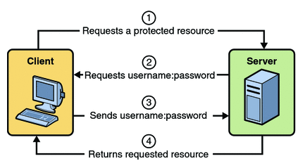
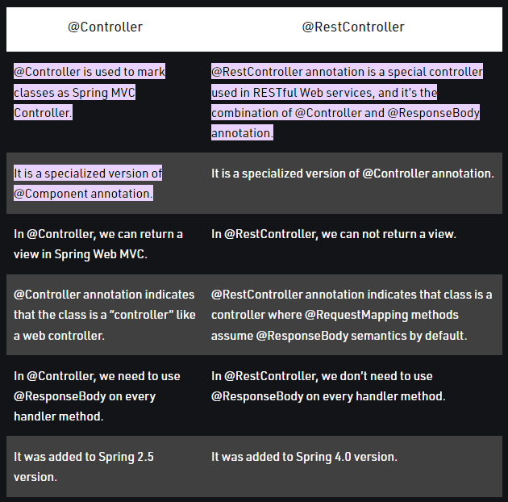
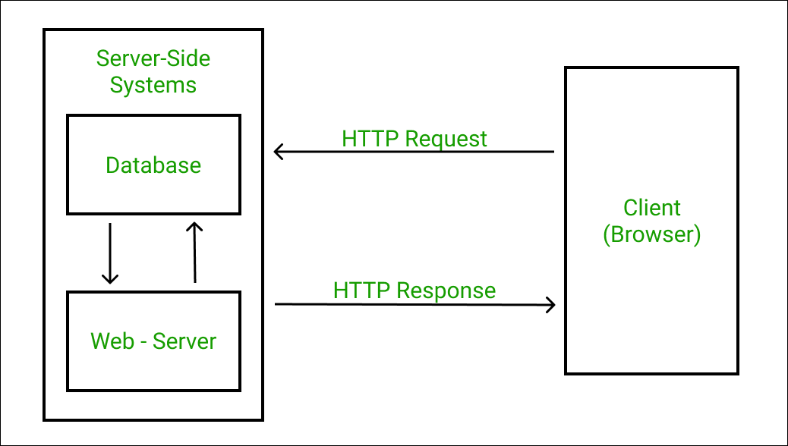
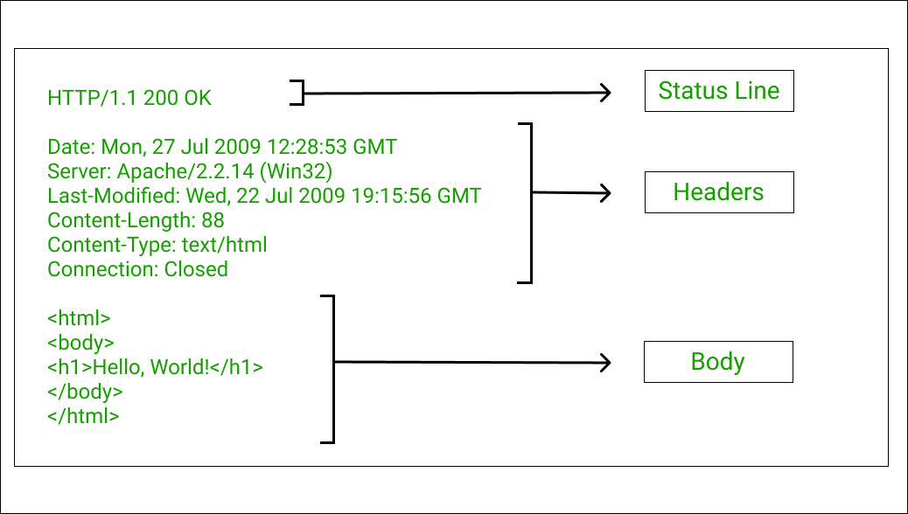

# HW3
## 1 – SOAP vs Restful ?
REST and SOAP are 2 different approaches to online data transmission. Specifically, both define how to build application programming interfaces (APIs), which allow data to be communicated between web applications. Representational state transfer (REST) is a set of architectural principles. Simple object access protocol (SOAP) is an official protocol maintained by the World Wide Web Consortium (W3C). The main difference is that SOAP is a protocol while REST is not. Typically, an API will adhere to either REST or SOAP, depending on the use case and preferences of the developer.
### REST: representational state transfer
REST is a set of architectural principles attuned to the needs of lightweight web services and mobile applications. Because it's a set of guidelines, it leaves the implementation of these recommendations to developers.

When a request for data is sent to a REST API, it’s usually done through hypertext transfer protocol (commonly referred to as HTTP). Once a request is received, APIs designed for REST (called RESTful APIs or RESTful web services) can return messages in a variety of formats: HTML, XML, plain text, and JSON. JSON (JavaScript object notation) is favored as a message format because it can be read by any programming language (despite the name), is human- and machine-readable, and is lightweight. In this way, RESTful APIs are more flexible and can be easier to set up.

An application is said to be RESTful if it follows 6 architectural guidelines. A RESTful application must have:

- A client-server architecture composed of clients, servers, and resources.
- Stateless client-server communication, meaning no client content is stored on the server between requests. Information about the session’s state is instead held with the client.
- Cacheable data to eliminate the need for some client-server interactions.
- A uniform interface between components so that information is transferred in a standardized form instead of specific to an application’s needs. This is described by Roy Fielding, the originator of REST, as “the central feature that distinguishes the REST architectural style from other network-based styles.”
- A layered system constraint, where client-server interactions can be mediated by hierarchical layers.
- Code on demand, allowing servers to extend the functionality of a client by transferring executable code (though also reducing visibility, making this an optional guideline).
### SOAP: simple object access protocol
SOAP is a standard protocol that was first designed so that applications built with different languages and on different platforms could communicate. Because it is a protocol, it imposes built-in rules that increase its complexity and overhead, which can lead to longer page load times. However, these standards also offer built-in compliances that can make it preferable for enterprise scenarios. The built-in compliance standards include security, atomicity, consistency, isolation, and durability (ACID), which is a set of properties for ensuring reliable database transactions.

Common web service specifications include:

- Web services security (WS-security): Standardizes how messages are secured and transferred through unique identifiers called tokens.
- WS-ReliableMessaging: Standardizes error handling between messages transferred across unreliable IT infrastructure.
- Web services addressing (WS-addressing): Packages routing information as metadata within SOAP headers, instead of maintaining such information deeper within the network.
- Web services description language (WSDL): Describes what a web service does, and where that service begins and ends.
- When a request for data is sent to a SOAP API, it can be handled through any of the application layer protocols: HTTP (for web browsers), SMTP (for email), TCP, and others. However, once a request is received, return SOAP messages must be returned as XML documents—a markup language that is both human- and machine-readable. A completed request to a SOAP API is not cacheable by a browser, so it cannot be accessed later without resending to the API.

### SOAP vs. REST
Many legacy systems may still adhere to SOAP, while REST came later and is often viewed as a faster alternative in web-based scenarios. REST is a set of guidelines that offers flexible implementation, whereas SOAP is a protocol with specific requirements like XML messaging.

REST APIs are lightweight, making them ideal for newer contexts like the Internet of Things (IoT), mobile application development, and serverless computing. SOAP web services offer built-in security and transaction compliance that align with many enterprise needs, but that also makes them heavier. Additionally, many public APIs, like the Google Maps API, follow the REST guidelines.
## 2 - Difference between acceptance test and functional test ?
The functional test confirms the software performs a function within the boundaries of how you've solved the problem. This is an integral part of developing software, comparable to the testing that is done on mass produced product before it leaves the factory. A functional test verifies that the product actually works as you (the developer) think it does.

Acceptance tests verify the product actually solves the problem it was made to solve. This can best be done by the user (customer), for instance performing his/her tasks that the software assists with. If the software passes this real world test, it's accepted to replace the previous solution. This acceptance test can sometimes only be done properly in production, especially if you have anonymous customers (e.g. a website). Thus a new feature will only be accepted after days or weeks of use.
- Functional testing 

Test the product, verifying that it has the qualities you've designed or build (functions, speed, errors, consistency, etc.)

- Acceptance testing 

Test the product in its context, this requires (simulation of) human interaction, test it has the desired effect on the original problem(s).
## 3 - What is Mocking ?
Mock is an Object that clone the behavior of a real object. It is basically used in Unit Testing by testing the isolated unit even when Backend is not available.
### Why we use MOCK object?
The unit testing purpose is to approve each unit of software designed and verify that the generated code is working perfectly, interdependent on external dependencies. Most of the cases, Code under test has some external dependencies like APIs and It would be better to create a mock object instead of generating test cases on the real object of the dependencies.
## 4 - What is a reasonable code coverage % for unit tests (and why) ?
The simplest measure of unit testing is statement coverage. Teams can calculate statement coverage by dividing the number of code lines the unit tests execute by the number of executable lines of code. Most tools can provide this percentage, but teams can also use the following function to find their statement coverage percentage.

While there is no standard for unit testing, one number often cited in the testing world is 80%. "Eighty percent is what I usually see as the gating standard for code coverage in corporate shops," said Tim Ottinger, a senior consultant at Industrial Logic. "Any higher or lower than that is unusual."

Matt Baldwin, manager for development enablement at Affirm, also suggested 80%. "The interesting thing is not the 80%, but the 20% that is not covered," Baldwin said. "To find the part of uncovered code that matters, examine the incident reports for the problematic teams. Look for mistakes in thinking that are repeated -- from analysis to code to tests -- and take corrective action."

For example, let's say there's a team with a high number of incidents that require rework, or the incidents have a high amount of customer impact. If the coverage number is below 80%, and unit tests could reasonably resolve the incidents, it may be time to get those numbers up. Likewise, if the number is below 80%, but the team doesn't have problems that lead to rework or customer outage, there may be other priorities to work on right now besides focusing on unit tests.

Another way to look at coverage is to compare new development and legacy software. If all new development meets that 80% code coverage standard and the legacy software code improves with every change, it might not be worth it to fix the problem. A mixed measure of say, 30% coverage, might fail to recognize the breakdown is closer to 10% (old) and 90% (new development).
## 5 – HTTP/POST vs HTTP/PUT ?
PUT puts a file or resource at a specific URI, and exactly at that URI. If there's already a file or resource at that URI, PUT replaces that file or resource. If there is no file or resource there, PUT creates one.

POST sends data to a specific URI and expects the resource at that URI to handle the request. The web server at this point can determine what to do with the data in the context of the specified resource.

- PUT method is called when you have to modify a single resource while POST method is called when you have to add a child resource.
- PUT method response can be cached but you cannot cache POST method responses.
- You can use UPDATE query in PUT whereas you can use create query in POST.
- In PUT method, the client decides which URI resource should have, and in POST method, the server decides which URI resource should have.
- PUT works as specific while POST work as abstract.
- If you send the same PUT request multiple times, the result will remain the same but if you send the same POST request multiple times, you will receive different results.
- PUT method is idempotent whereas POST method is not idempotent.
## 6 - What are the Safe and Unsafe methods of HTTP ?
Idempotency and safety are properties of HTTP methods. The HTTP RFC defines these properties and tells us which HTTP methods are safe and idempotent. Server application should make sure to implement the safe and idempotent semantic correctly as clients might expect it.
### Safe HTTP methods
HTTP methods are considered safe if they do not alter the server state. So safe methods can only be used for read-only operations. The HTTP RFC defines the following methods to be safe: GET, HEAD, OPTIONS and TRACE.
### Idempotent HTTP methods
Idempotency means that multiple identical requests will have the same outcome. So it does not matter if a request is sent once or multiple times. The following HTTP methods are idempotent: GET, HEAD, OPTIONS, TRACE, PUT and DELETE. All safe HTTP methods are idempotent but PUT and DELETE are idempotent but not safe.
Note that idempotency does not mean that the server has to respond in the same way on each request.

## 7 - How does HTTP Basic Authentication work ?
HTTP Basic Authentication requires that the server request a user name and password from the web client and verify that the user name and password are valid by comparing them against a database of authorized users. When basic authentication is declared, the following actions occur:

- A client requests access to a protected resource.

- The web server returns a dialog box that requests the user name and password.

- The client submits the user name and password to the server.

- The server authenticates the user in the specified realm and, if successful, returns the requested resource.


## 8 - Define RestTemplate in Spring ?
Rest Template is used to create applications that consume RESTful Web Services.
RestTemplate is a synchronous client to perform HTTP requests. It uses a simple, template method API over underlying HTTP client libraries such as the JDK HttpURLConnection, Apache HttpComponents, and others.

## 9 – What is the difference between @Controller and @RestController ?

## 10 – What is DNS Spoofing ? How to prevent ?
DNS (Domain Name Service) spoofing is the process of poisoning entries on a DNS server to redirect a targeted user to a malicious website under attacker control. The DNS attack typically happens in a public Wi-Fi environment but can occur in any situation where the attacker can poison ARP (Address Resolution Protocol) tables and force targeted user devices into using the attacker-controlled machine as the server for a specific website. It’s the first step in a sophisticated phishing attack on public Wi-Fi, and it can also trick users into installing malware on their devices or divulge sensitive information.

Any user that accesses the internet from public Wi-Fi is vulnerable to DNS spoofing. To protect from DNS spoofing, internet providers can use DNSSEC (DNS security). When a domain owner sets up DNS entries, DNSSEC adds a cryptographic signature to the entries required by resolvers before they accept DNS lookups as authentic.

Standard DNS is not encrypted, and it’s not programmed to ensure that changes and resolved lookups are from legitimate servers and users. DNSSEC adds a signature component to the process that verifies updates and ensures that DNS spoofing is blocked. DNSSEC has gained more popularity recently as DNS spoofing threatens to breach user data privacy across any public Wi-Fi.
## 11 – What is content negotiation ?
Content negotiation refers to mechanisms defined as a part of HTTP that make it possible to serve different versions of a document (or more generally, representations of a resource) at the same URI, so that user agents can specify which version fits their capabilities the best. One classical use of this mechanism is to serve an image in GIF or PNG format, so that a browser that cannot display PNG images (e.g. MS Internet Explorer 4) will be served the GIF version.

A resource may be available in several different representations; for example, it might be available in different languages or different media types. One way of selecting the most appropriate choice is to give the user an index page and let them select the most appropriate choice; however it is often possible to automate the choice based on some selection criteria.
## 12 – What is statelessness in RESTful Web Services ?
As per the REST architecture, a RESTful Web Service should not keep a client state on the server. This restriction is called Statelessness. It is the responsibility of the client to pass its context to the server and then the server can store this context to process the client's further request. For example, session maintained by server is identified by session identifier passed by the client.

RESTful Web Services should adhere to this restriction. We have seen this in the RESTful Web Services - Methods chapter, that the web service methods are not storing any information from the client they are invoked from.

Consider the following URL −

https://localhost:8080/UserManagement/rest/UserService/users/1
```
<user> 
   <id>1</id> 
   <name>mahesh</name> 
   <profession>1</profession> 
</user>
````
### Advantages of Statelessness

- Web services can treat each method request independently.

- Web services need not maintain the client's previous interactions. It simplifies the application design.

- As HTTP is itself a statelessness protocol, RESTful Web Services work seamlessly with the HTTP protocols.
### Disadvantages of Statelessness

- Web services need to get extra information in each request and then interpret to get the client's state in case the client interactions are to be taken care of.
## 13 - What is CSRF attack? How to prevent ?
Cross-site Request Forgery, also known as CSRF, Sea Surf, or XSRF, is an attack whereby an attacker tricks a victim into performing actions on their behalf. The impact of the attack depends on the level of permissions that the victim has. Such attacks take advantage of the fact that a website completely trusts a user once it can confirm that the user is indeed who they say they are.

Cross-site Request Forgery is considered a sleeping giant in the world of web application security. It is often not taken as seriously as it should even though it can prove to be a stealthy and powerful attack if executed properly. It is also a common attack, which is why it has secured a spot on the OWASP Top 10 list several times in a row. However, an exploited Cross-site Scripting vulnerability (XSS) is more of a risk than any CSRF vulnerability because CSRF attacks have a major limitation. CSRF only allows for state changes to occur and therefore the attacker cannot receive the contents of the HTTP response.

Security experts propose many CSRF prevention mechanisms. This includes, for example, using a referer header, using the HttpOnly flag, sending an X-Requested-With custom header using jQuery, and more. Unfortunately, not all of them are effective in all scenarios. In some cases, they are ineffective and in other cases, they are difficult to implement in a particular application or have side effects. The following implementations prove to be effective for a variety of web apps while still providing protection against CSRF attacks.

The most popular method to prevent Cross-site Request Forgery is to use a challenge token that is associated with a particular user and that is sent as a hidden value in every state-changing form in the web app. This token, called an anti-CSRF token (often abbreviated as CSRF token) or a synchronizer token, works as follows:

- The web server generates a token and stores it
- The token is statically set as a hidden field of the form
- The form is submitted by the user
- The token is included in the POST request data
- The application compares the token generated and stored by the application with the token sent in the request
- If these tokens match, the request is valid
- If these tokens do not match, the request is invalid and is rejected

This CSRF protection method is called the synchronizer token pattern. It protects the form against Cross-site Request Forgery attacks because an attacker would also need to guess the token to successfully trick a victim into sending a valid request. The token should also be invalidated after some time and after the user logs out. Anti-CSRF tokens are often exposed via AJAX: sent as headers or request parameters with AJAX requests.

For an anti-CSRF mechanism to be effective, it needs to be cryptographically secure. The token cannot be easily guessed, so it cannot be generated based on a predictable pattern. We also recommend to use anti-CSRF options in popular frameworks such as AngularJS and refrain from creating own mechanisms, if possible. This lets you avoid errors and makes the implementation quicker and easier.
## 14 - What are the core components of the HTTP request and HTTP response ?
Whenever our client application wants to communicate to the server, it sends out a message to the server using HTTP Protocols, which is also termed as the HTTP Request. Based on that message, the server performs certain operations as demanded by the message and then replies to the client through a message, also knows as HTTP Response.

### Structure of HTTP Response
As discussed above, the HTTP Response has a special structure that is followed so that the client can easily understand it. There exists a Universal Language that everybody follows so that there is no communication gap between people. HTTP Response broadly has 3 main components:

- Status Line
- Headers
- Body (Optional)
