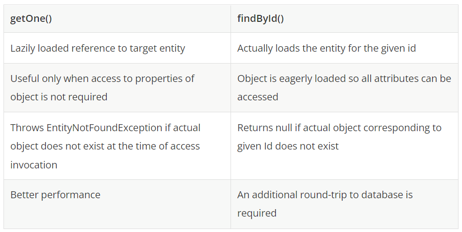
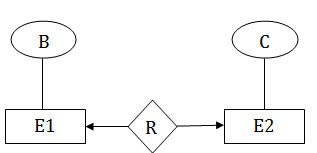

# HW4
## 1 – What is JPA ?
The Java Persistence API (JPA) is a specification of Java. It is used to persist data between Java object and relational database. JPA acts as a bridge between object-oriented domain models and relational database systems.

As JPA is just a specification, it doesn't perform any operation by itself. It requires an implementation. So, ORM tools like Hibernate, TopLink and iBatis implements JPA specifications for data persistence.
## 2 - What is the naming convention for finder methods in the Spring data repository interface ?
### Default Naming Convention for Spring Data JPA
First of all, let's see what Spring's default naming convention regarding table and column names.

Let's imagine we have a Person entity:
````
@Entity
public class Person {
    @Id
    private Long id;
    private String firstName;
    private String lastName;
}
````
We have a few names here that have to be mapped to the database. Well, Spring uses lower snake case by default, which means it uses only lower case letters and separates words with underscores. Therefore, the table creation query for the Person entity would be:
````
create table person (id bigint not null, first_name varchar(255), last_name varchar(255), primary key (id));
````
And a selection query returning all first names would be:
````
select first_name from person;
````
## 3 - What is PagingAndSortingRepository ?
PagingAndSortingRepository is an extension of CrudRepository to provide additional methods to retrieve entities using the pagination and sorting abstraction. It provides two methods :

- Page findAll(Pageable pageable) – returns a Page of entities meeting the paging restriction provided in the Pageable object.
- Iterable findAll(Sort sort) – returns all entities sorted by the given options. No paging is applied here.
````
EmployeeRepository.java
import org.springframework.data.repository.PagingAndSortingRepository;
import org.springframework.stereotype.Repository;
 
import com.howtodoinjava.demo.entity.EmployeeEntity;
 
@Repository
public interface EmployeeRepository 
        extends PagingAndSortingRepository<EmployeeEntity, Long> {
 
}
````
## 4 - Differentiate between findById() and getOne() ?
Both findById() and getOne() methods are used to retrieve an object from underlying datastore. But the underlying mechanism for retrieving records is different for both these methods, infact getOne() is lazy operation which does not even hit the database.

### getOne() method
getOne() returns a reference to the entity with the given identifier. getOne internally invokes EntityManager.getReference() method. As per docs, this method will always return a proxy without hitting the database (lazily fetched). This method will throw EntityNotFoundException at the time of actual access if the requested entity does not exist in the database.

### findById() method
This method will actually hit the database and return the real object mapping to a row in the database. It is EAGER loaded operation that returns null if no record exists in database.
### Which one to choose?
The only real difference between these methods is about the performance. Lazily loaded getOne() method avoids database roundtrip from the JVM as it never hits the database until the properties of returned proxy object are actually accessed.

## 5 - What is @Query used for ?
Derived queries are very comfortable to use as long as the queries are not too complicated. But as soon as you use more than 2-3 query parameters or need to define multiple joins to other entities, you need a more flexible approach. In these situations, you better use Spring Data JPA’s @Query annotation to specify a custom JPQL or native SQL query.

The @Query annotation gives you full flexibility over the executed statement, and your method name doesn’t need to follow any conventions. The only thing you need to do is to define a method in your repository interface, annotate it with @Query, and provide the statement that you want to execute.
## 6 - What is lazy loading in hibernate ?
In an application, Hibernate fetches data from the database either in eager or lazy mode. Lazy loading refers to a strategy where data is loaded lazily on-demand when the application needs to access it.

Consider one of the common Internet web applications: the online store. The store maintains a catalog of products (call it a Category). At the crudest level, this can be modeled as a Category entity managing a series of Product entities. In a large store, there maybe tens of thousands of products grouped into various overlapping categories.

When a customer visits the store, the categories must be loaded from the database. We probably don’t want the application to load every single one of the product entities representing the tens of thousands of products to be loaded into memory. For a sufficiently large retailer, this might not even be possible, given the amount of physical memory available on the machine.

Even if this was possible, it would probably cripple the performance of the site. Instead, we want only the categories to load. Only when the user drills down into the categories should a subset of the products in that category be loaded from the database.

To manage this problem, Hibernate provides a facility called lazy loading. When lazy loading is enabled, an entity’s associated entities will be loaded only when they are directly requested.

The default behavior is to load ‘property values eagerly’ and to load ‘collections lazily’. Contrary to what you might remember if you have used plain Hibernate 2 (mapping files) before, where all references (including collections) are loaded eagerly by default.

- @OneToMany and @ManyToMany associations are defaulted to LAZY loading; and
- @OneToOne and @ManyToOne are defaulted to EAGER loading. This is important to remember to avoid any pitfall in future.
## 7 – What is SQL injection attack ? Is Hibernate open to SQL injection attack ?
SQL injection, also known as SQLI, is a common attack vector that uses malicious SQL code for backend database manipulation to access information that was not intended to be displayed. This information may include any number of items, including sensitive company data, user lists or private customer details.

The impact SQL injection can have on a business is far-reaching. A successful attack may result in the unauthorized viewing of user lists, the deletion of entire tables and, in certain cases, the attacker gaining administrative rights to a database, all of which are highly detrimental to a business.

When calculating the potential cost of an SQLi, it’s important to consider the loss of customer trust should personal information such as phone numbers, addresses, and credit card details be stolen.

While this vector can be used to attack any SQL database, websites are the most frequent targets.
### Is Hibernate open to SQL injection attack
This is a common misconception. JPA and other ORMs relieves us from creating hand-coded SQL statements, but they won't prevent us from writing vulnerable code.
## 8 - What is criteria API in hibernate ?
It enables us to write queries without doing raw SQL as well as gives us some object-oriented control over the queries, which is one of the main features of Hibernate. The Criteria API allows us to build up a criteria query object programmatically, where we can apply different kinds of filtration rules and logical conditions.

Since Hibernate 5.2, the Hibernate Criteria API is deprecated, and new development is focused on the JPA Criteria API. We'll explore how to use Hibernate and JPA to build Criteria Queries.

Example:
````
public class Item implements Serializable {

    private Integer itemId;
    private String itemName;
    private String itemDescription;
    private Integer itemPrice;

   // standard setters and getters
}
````
Let's look at a simple criteria query that will retrieve all the rows of “ITEM” from the database:
````
Session session = HibernateUtil.getHibernateSession();
CriteriaBuilder cb = session.getCriteriaBuilder();
CriteriaQuery<Item> cr = cb.createQuery(Item.class);
Root<Item> root = cr.from(Item.class);
cr.select(root);

Query<Item> query = session.createQuery(cr);
List<Item> results = query.getResultList();
````
The above query is a simple demonstration of how to get all the items. Let's see it step by step:
- Create an instance of Session from the SessionFactory object
- Create an instance of CriteriaBuilder by calling the getCriteriaBuilder() method
- Create an instance of CriteriaQuery by calling the CriteriaBuilder createQuery() method
- Create an instance of Query by calling the Session createQuery() method
- Call the getResultList() method of the query object, which gives us the results
## 9 - What Is Erlang? Why is it «required» for RabbitMQ ?
### Erlang
Erlang is a general-purpose programming language and runtime environment. Erlang has built-in support for concurrency, distribution and fault tolerance. Erlang is used in several large telecommunication systems from Ericsson. Erlang is available as open source from http://www.erlang.org.
### What is OTP?
OTP (Open Telecom Platform) is a large collection of libraries for Erlang to do everything from compiling ASN.1 to providing a WWW server. Most projects using "Erlang" are actually using "Erlang/OTP", i.e. the language and the libraries. OTP is also open source.
### RabbitMQ
RabbitMQ is a message-queueing software also known as a message broker or queue manager and is written with Erlang . Simply said; it is software where queues are defined, to which applications connect in order to transfer a message or messages.
## 10 – What is the JPQL ?
JPQL is Java Persistence Query Language defined in JPA specification. It is used to create queries against entities to store in a relational database. JPQL is developed based on SQL syntax. But it won’t affect the database directly.

JPQL can retrieve information or data using SELECT clause, can do bulk updates using UPDATE clause and DELETE clause. EntityManager.createQuery() API will support for querying language.

JPQL syntax is very similar to the syntax of SQL. Having SQL like syntax is an advantage because SQL is a simple structured query language and many developers are using it in applications. SQL works directly against relational database tables, records and fields, whereas JPQL works with Java classes and instances.

For example, a JPQL query can retrieve an entity object rather than field result set from database, as with SQL. The JPQL query structure as follows.
````
SELECT ... FROM ...
[WHERE ...]
[GROUP BY ... [HAVING ...]]
[ORDER BY ...]
````
The structure of JPQL DELETE and UPDATE queries is simpler as follows:
````
DELETE FROM ... [WHERE ...]

UPDATE ... SET ... [WHERE ...]
````
## 11 – What are the steps to persist an entity object ?
1) Creating an entity manager factory object

The EntityManagerFactory interface present in java.persistence package is used to provide an entity manager.
````
EntityManagerFactory emf=Persistence.createEntityManagerFactory("Student_details");  
````
- Persistence - The Persistence is a bootstrap class which is used to obtain an EntityManagerFactory interface.
- createEntityManagerFactory() method - The role of this method is to create and return an EntityManagerFactory for the named persistence unit. Thus, this method contains the name of persistence unit passed in the Persistence.xml file.
2) Obtaining an entity manager from factory.
````
EntityManager em=emf.createEntityManager();  
````
- EntityManager - An EntityManager is an interface
- createEntityManager() method - It creates new application-managed EntityManager
3) Intializing an entity manager.
```` 
em.getTransaction().begin(); 
````
- getTransaction() method - This method returns the resource-level EntityTransaction object.
- begin() method - This method is used to start the transaction.
4) Persisting a data into relational database.
```` 
em.persist(s1);  
````
- persist() - This method is used to make an instance managed and persistent. An entity instance is passed within this method.
5) Closing the transaction
```` 
em.getTransaction().commit();
````
6) Releasing the factory resources.
```` 
emf.close();  
    em.close();  
````
- close() - This method is used to releasing the factory resources.
## 12 – What are the different types of entity mapping ?
Mapping constraint is a data constraint that expresses the number of entities to which another entity can be related via a relationship set.
It is most useful in describing the relationship sets that involve more than two entity sets.
For binary relationship set R on an entity set A and B, there are four possible mapping cardinalities. These are as follows:
- One to one (1:1)
- One to many (1:M)
- Many to one (M:1)
- Many to many (M:M)


### One-to-one
In one-to-one mapping, an entity in E1 is associated with at most one entity in E2, and an entity in E2 is associated with at most one entity in E1.

### One-to-many
In one-to-many mapping, an entity in E1 is associated with any number of entities in E2, and an entity in E2 is associated with at most one entity in E1.

### Many-to-one
In one-to-many mapping, an entity in E1 is associated with at most one entity in E2, and an entity in E2 is associated with any number of entities in E1.

### Many-to-many
In many-to-many mapping, an entity in E1 is associated with any number of entities in E2, and an entity in E2 is associated with any number of entities in E1.

## 13 - What are the properties of an entity ?
In general, entity is a group of states associated together in a single unit. On adding behaviour, an entity behaves as an object and becomes a major constituent of object-oriented paradigm. So, an entity is an application-defined object in Java Persistence Library.

### Entity Properties
These are the properties of an entity that an object must have:

- Persistability - An object is called persistent if it is stored in the database and can be accessed anytime.
- Persistent Identity - In Java, each entity is unique and represents as an object identity. Similarly, when the object identity is stored in a database then it is represented as persistence identity. This object identity is equivalent to primary key in database.
- Transactionality - Entity can perform various operations such as create, delete, update. Each operation makes some changes in the database. It ensures that whatever changes made in the database either be succeed or failed atomically.
- Granuality - Entities should not be primitives, primitive wrappers or built-in objects with single dimensional state.
### Entity Metadata
Each entity is associated with some metadata that represents the information of it. Instead of database, this metadata is exist either inside or outside the class. This metadata can be in following forms: -

- Annotation - In Java, annotations are the form of tags that represents metadata. This metadata persist inside the class.
- XML - In this form, metadata persist outside the class in XML file.
## 14 - Difference between CrudRepository and JpaRepository in Spring Data JPA?
JpaRepository extends PagingAndSortingRepository that extends CrudRepository.

- CrudRepository mainly provides CRUD operations.

- PagingAndSortingRepository provide methods to perform pagination and sorting of records.

- JpaRepository provides JPA related methods such as flushing the persistence context and deleting of records in batch.

Due to their inheritance nature, JpaRepository will have all the behaviors of CrudRepository and PagingAndSortingRepository. So if you don't need the repository to have the functions provided by JpaRepository and PagingAndSortingRepository , use CrudRepository.
