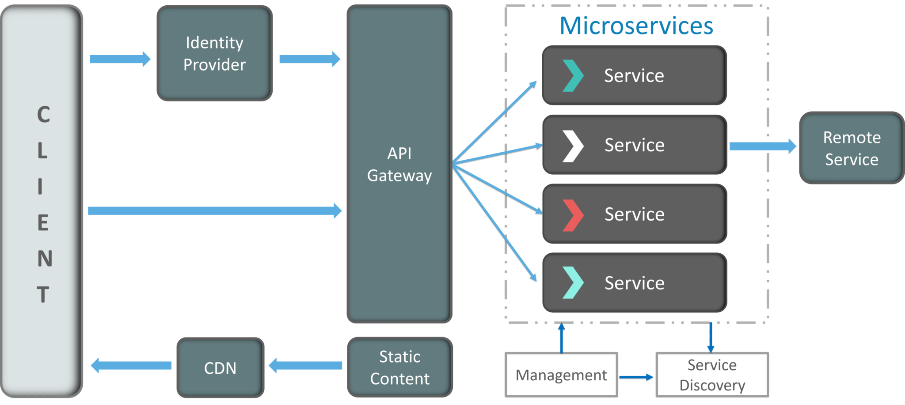
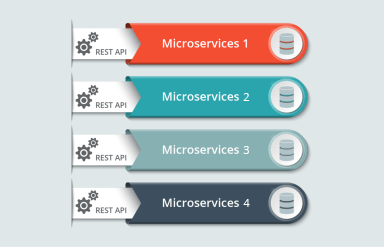
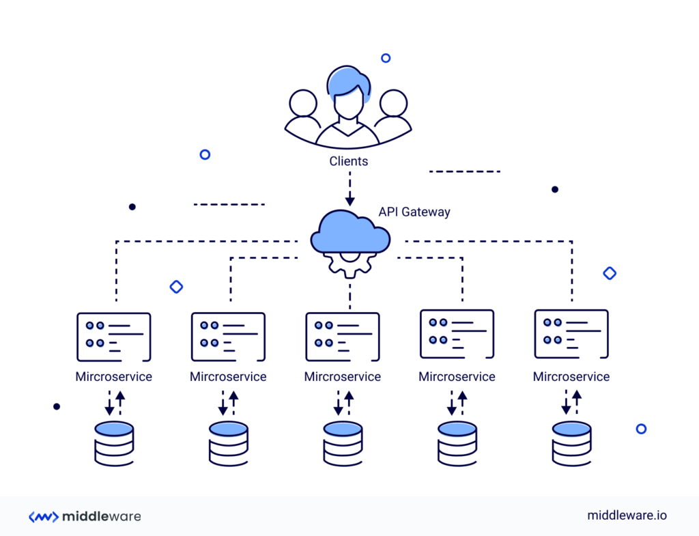

# HW6
## 1 – What is the difference between manual testing and automated testing ?
### Manual Testing
Manual testing is testing of the software where tests are executed manually by a QA Analyst. It is performed to discover bugs in software under development.

In Manual testing, the tester checks all the essential features of the given application or software. In this process, the software testers execute the test cases and generate the test reports without the help of any automation software testing tools.

It is a classical method of all testing types and helps find bugs in software systems. It is generally conducted by an experienced tester to accomplish the software testing process.
### Automation Testing
In Automated Software Testing, testers write code/test scripts to automate test execution. Testers use appropriate automation tools to develop the test scripts and validate the software. The goal is to complete test execution in a less amount of time.

Automated testing entirely relies on the pre-scripted test which runs automatically to compare actual result with the expected results. This helps the tester to determine whether or not an application performs as expected.

Automated testing allows you to execute repetitive task and regression test without the intervention of manual tester. Even though all processes are performed automatically, automation requires some manual effort to create initial testing scripts.
### Differences
- Manual Testing is done manually by QA analyst (Human) whereas Automation Testing is done with the use of script, code and automation tools (computer) by a tester.
- Manual Testing process is not accurate because of the possibilities of human errors whereas the Automation process is reliable because it is code and script based.
- Manual Testing is a time-consuming process whereas Automation Testing is very fast.
- Manual Testing is possible without programming knowledge whereas Automation Testing is not possible without programming knowledge.
- Manual Testing allows random Testing whereas Automation Testing doesn’t allow random Testing.
## 2 – What does Assert class ?
Assert is a method useful in determining Pass or Fail status of a test case, The assert methods are provided by the class org.junit.Assert which extends java.lang.Object class.

There are various types of assertions like Boolean, Null, Identical etc.
## 3 - How can be tested 'private' methods ?
You generally don't unit test private methods directly. Since they are private, consider them an implementation detail. Nobody is ever going to call one of them and expect it to work a particular way.

You should instead test your public interface. If the methods that call your private methods are working as you expect, you then assume by extension that your private methods are working correctly.
## 4 – What is Monolithic Architecture ?
Monolithic software is designed to be self-contained, wherein the program's components or functions are tightly coupled rather than loosely coupled, like in modular software programs. In a monolithic architecture, each component and its associated components must all be present for code to be executed or compiled and for the software to run.

Monolithic applications are single-tiered, which means multiple components are combined into one large application. Consequently, they tend to have large codebases, which can be cumbersome to manage over time.

Furthermore, if one program component must be updated, other elements may also require rewriting, and the whole application has to be recompiled and tested. The process can be time-consuming and may limit the agility and speed of software development teams. Despite these issues, the approach is still in use because it does offer some advantages. Also, many early applications were developed as monolithic software, so the approach cannot be completely disregarded when those applications are still in use and require updates.
## 5 - What are the best practices to write a Unit Test Case ?
### Write Readable Tests
Easy-to-read tests are comforting to understand how your code works, its intent, and what went wrong when the test fails. Tests revealing the setup logic at first glance are more convenient for figuring out how to fix the problem without debugging the code. Such readability also improves the maintainability of tests since the production code changes are required to be updated in the tests also. Moreover, difficult-to-read tests create more misunderstandings among developers, resulting in more bugs.
lso, unit tests naturally serve as documentation since they describe the behavioral aspect of the subject and validate it. So when you write clear and readable tests, you’re not only doing your future self a favor but also to other developers who are new on the team or are not even hired yet. It instantly familiarizes them with the code and entire systems without bothering anyone else.

- Now, to answer how to write easy and enjoyable tests to read, here are some effective ways.
- Firstly, have a sound naming convention for every test case. Name tests in such a way that it instantly describe the subject, what scenario is being tested, and the expected result.
- Secondly, use Arrange, Act, Assert pattern to clearly define the test phases and enhance readability.
- Lastly, avoid using magic numbers or strings in the test cases, which takes us to our next tip.
### Avoid magic numbers and magic strings
The use of magic strings or numbers confuses readers since it makes the tests less readable. In addition, it diverts readers from looking at the implementation details and makes them wonder why a particular value has been chosen instead of focusing on the actual test. 

On the other hand, if a constant needs to be changed, changing it in one place updates all the other values. So, it is better to use variables or constants in the tests for assigning values. It would help you to express as much intent as possible while writing tests.
### Write Deterministic Tests
   Deterministic tests either pass all the time or fail all the time until fixed. But they exhibit the same behavior every time they are run unless the code is changed. So a flaky test, aka a non-deterministic test that sometimes passes and sometimes fails, is as good as having no test at all.

For instance, you built a unit test for function calculateInterest(), and it passed. It should continue to pass until changes are made to calculateInterest(). Or if it fails, it should fail every time, even if it is run ten or a thousand times, until the error with calculateInterest() is fixed. If the test is flaky, developers don’t trust it and render it irrelevant as there is no definite indication of a bug in the code or any clear output.

To avoid non-deterministic tests, ensure that they are completely isolated and are not dependent on other test cases. You can fix flaky tests by controlling external dependencies and environmental values like the current time or language settings of the machine.
### Avoid test interdependencies
   Test runners generally run multiple unit tests at a time without sticking to any particular order, so interdependencies between tests make them unstable and difficult to execute and debug. You should ensure each test case has its own setup and teardown mechanism to avoid test interdependencies.

For example, suppose the test runner is running a few tests in a particular order for a while and a new test is added without its own setup. Now, if the test runner runs all the tests parallelly to reduce execution time, it’d disorient the whole test suite, and your tests will start failing.

Now the question is, how to write completely independent tests?

The first is, to not assume anything based on the order that you write test cases. If tests are coupled together, isolate the code into small groups/classes to be tested independently. Otherwise, changes in one unit can affect other units and cause the entire suite to fail.
### Avoid logic in tests
   Writing unit tests with logical conditions and manual strings concatenation increases the chances of bugs in your test suite. Tests should focus on the expected end result instead of the implementation details. Adding conditions such as if, while, switch, for, etc., can make the tests less deterministic and readable. If including logic in a test seems unavoidable, you can split the test into two or more different tests.
### Refrain multiple asserts in a single unit test
   For a unit test to be effective, keep one use case at a time, that is to have only one assertion in the tests. If you’re wondering what would happen if you include multiple asserts in a single test, let’s take a simple example.

Sometimes more than 10 asserts are included in one set in order to cover more features. Such cases result in going through all assertions to check the root cause of the problem, even if a single failure has occurred. Plus, the rest of the assertions never get checked if one assertion is failed, resulting in an unclear vision of the test being failed.

Although it seems tedious to write separate test scripts for each assertion, overall it saves more time, effort and is more definitive in the long run. You can also use parameterized tests as they enable you to run the same test multiple times with different values.
### Keep your tests away from too much implementation details
   Tests are difficult to maintain if they keep failing even for the slightest changes made to the implementation code. So the best bet is to keep implementation details at bay and save your time from rewriting the tests repeatedly. Thus, coupling tests with implementation details decrease the value of tests.

Unit tests are more resilient to change if they are not heavily paired with the production code’s internals. It also allows developers to refactor when required and provides valuable feedback with a safety net.
### Write tests during development, not after it
   Unit tests are at the base of the testing pyramid and are the earliest tests conducted in the development cycle. Therefore, they work best when they are run alongside the development and not after it.

Setting up unit tests as early as possible promotes writing clean code and identifying bugs early on. Writing tests at the end of development may result in non-testable code. On the contrary, writing tests parallel to the production code allows us to review both test code and production code together. It further helps the developers better understand the code. It also makes the process of unit testing more scalable and sustainable.

Some organizations prefer writing unit tests before the production code, which essentially becomes Test-driven development (TDD). This practice helps you mentally prepare for the expected behavior of the code. It raises questions and cases even before you start writing the code unlike asking them during the development process. TDD approach helps reduce time spent on reworks and debugging. It instantly tells you if the last refactoring broke the previously working code or not. Combined with unit testing, it can identify errors and problems quickly.
### Automate tests using CI/CD tools

Automating the tests by including them in a CI/CD pipeline allows you to easily run tests multiple times in a day. It enables continuous testing and test execution on each code commit. Even if you forget to run a test, the CI (Continuous Integration) server won’t and will prevent passing on buggy code to the customers.

On the contrary, manual testing cannot run a sufficient number of tests rapidly, conveniently, and accurately enough. It becomes especially difficult with tight deadlines to roll out software.

Automated tests help in the early detection of bugs, give rapid feedback, and adds an extra layer of safety. In addition, it provides insights on code coverage, modified code coverage, how many tests are running, performance, etc., which enables in-depth analysis and developers to work efficiently.
### Update the tests periodically
    
Unit tests are ideal for long-term projects since it helps new team members with detailed documentation by making the code and its behavior easier to understand. So maintaining and updating the tests periodically makes them ideal test suites for creating helpful documentation. Unit tests lacking this quality are less useful since it eventually slows down the work progress of your team.
## 6 - Why does JUnit only report the first failure in a single test ?
Reporting multiple failures in a single test is generally a sign that the test does too much, compared to what a unit test ought to do. Usually this means either that the test is really a functional/acceptance/customer test or, if it is a unit test, then it is too big a unit test.

JUnit is designed to work best with a number of small tests. It executes each test within a separate instance of the test class. It reports failure on each test. Shared setup code is most natural when sharing between tests. This is a design decision that permeates JUnit, and when you decide to report multiple failures per test, you begin to fight against JUnit. This is not recommended.

Long tests are a design smell and indicate the likelihood of a design problem. Kent Beck is fond of saying in this case that "there is an opportunity to learn something about your design." We would like to see a pattern language develop around these problems, but it has not yet been written down.
## 7 – What is the role of actuator in spring boot ?
Spring Boot Actuator is a sub-project of the Spring Boot Framework. It includes a number of additional features that help us to monitor and manage the Spring Boot application. It contains the actuator endpoints (the place where the resources live). We can use HTTP and JMX endpoints to manage and monitor the Spring Boot application. If we want to get production-ready features in an application, we should use the Spring Boot actuator.
There are three main features of Spring Boot Actuator:

- Endpoints
- Metrics
- Audit

**Endpoint:** The actuator endpoints allows us to monitor and interact with the application. Spring Boot provides a number of built-in endpoints. We can also create our own endpoint. We can enable and disable each endpoint individually. Most of the application choose HTTP, where the Id of the endpoint, along with the prefix of /actuator, is mapped to a URL.

For example, the /health endpoint provides the basic health information of an application. The actuator, by default, mapped it to /actuator/health.

**Metrics:** Spring Boot Actuator provides dimensional metrics by integrating with the micrometer. The micrometer is integrated into Spring Boot. It is the instrumentation library powering the delivery of application metrics from Spring. It provides vendor-neutral interfaces for timers, gauges, counters, distribution summaries, and long task timers with a dimensional data model.

**Audit:** Spring Boot provides a flexible audit framework that publishes events to an AuditEventRepository. It automatically publishes the authentication events if spring-security is in execution.
## 8 - What are the benefits and drawbacks of Microservices ?
### Advantages of microservices
The advantages of microservices seem strong enough to have convinced some big enterprise players such as Amazon, Netflix, and eBay to adopt the methodology. Compared to more monolithic design structures, microservices offer:
- **Improved fault isolation:** Larger applications can remain mostly unaffected by the failure of a single module.
- **Eliminate vendor or technology lock-in:** Microservices provide the flexibility to try out a new technology stack on an individual service as needed. There won’t be as many dependency concerns and rolling back changes becomes much easier. With less code in play, there is more flexibility.
- **Ease of understanding:** With added simplicity, developers can better understand the functionality of a service.
- **Smaller and faster deployments:** Smaller codebases and scope = quicker deployments, which also allow you to start to explore the benefits of Continuous Deployment.
- **Scalability:** Since your services are separate, you can more easily scale the most needed ones at the appropriate times, as opposed to the whole application. When done correctly, this can impact cost savings.
### Disadvantages of microservices
Microservices may be a hot trend, but the architecture does have drawbacks. In general, the main negative of microservices is the complexity that any distributed system has.
- **Communication between services is complex:** Since everything is now an independent service, you have to carefully handle requests traveling between your modules. In one such scenario, developers may be forced to write extra code to avoid disruption. Over time, complications will arise when remote calls experience latency.
- **More services equals more resources:** Multiple databases and transaction management can be painful.
- **Global testing is difficult:** Testing a microservices-based application can be cumbersome. In a monolithic approach, we would just need to launch our WAR on an application server and ensure its connectivity with the underlying database. With microservices, each dependent service needs to be confirmed before testing can occur.
- **Debugging problems can be harder:** Each service has its own set of logs to go through. Log, logs, and more logs.
- **Deployment challengers:** The product may need coordination among multiple services, which may not be as straightforward as deploying a WAR in a container.
- **Large vs small product companies:** Microservices are great for large companies, but can be slower to implement and too complicated for small companies who need to create and iterate quickly, and don’t want to get bogged down in complex orchestration.
## 9 - What are the challenges that one has to face while using Microservices ?
### 1. Overcoming Design Complexity
In the case of application design, taking a microservices approach simply means creating an application that is a bundle of loosely combined services that communicate with one another to achieve a predetermined business objective. Each microservice clarifies, encapsulates, and defines a specific business responsibility–not every aspect of the business. However, one should not attempt designing an enterprise-wide service.  Communication between microservices comes with a certain amount of overhead, making it difficult to design a proper means of communication between different services. You will need to handle requests moving back and forth between the services carefully. Although most developers follow a data-centric view to model a domain, ideally, you should start your design with context (business capability) and logic instead of data. Without the incorporation of logic, any amount of data would be rendered useless. You should also not use UI screens as guidelines to identify different data ownership and service boundaries. Two of the biggest challenges that a designer faces are identifying the correct boundaries and minute details of a microservice. As long as these remain unclear, breaking down your business requirements into specific domains, and eventually creating microservices that are sized adequately, would be extremely difficult to achieve.
### 2. Achieving Data Consistency 
In this system, with each service handling its data independently across data stores, the problem of data redundancy becomes real. Take, for example, data that might be stored for a particular transaction in one service. There is a high possibility that this same data would get stored in other services for reasons such as reporting, analytics, or archiving. Traditional techniques of managing data cannot enforce data relationships that span a conglomeration of services. The overall system would be in a consistent state only after each microservice has completed its work. Multiphase commits would be required for the division of logical schemas in a bounded context of wider transaction boundaries unless intermediate states are kept using saga patterns. Any changes to state get stored as journaled business events. Hence, the current state is not known by retrieving data from a store but by navigating the history of the business events and calculating from there onward.  Suppose numerous microservices are tied to the same tables in a database. In that case, any alteration in the schema will lead to cascading changes in other microservices as well, thereby negating the purpose of having independent microservices. As such, each microservice would be required to have complete ownership of the data it requires. However, this does not amount to having a separate physical database but simply ownership of the data that it controls. All types of databases are required by microservices such as NoSQL, Graph, and in-memory. Simply put, having a relational database that is the default storage of all types of data would not give the desired results.
### 3. Need for Testing and Monitoring 
If the required testing and monitoring tools are not in place, things can quickly escalate and go out of control. There are more services to monitor, but they also may have been developed using different programming languages. Also, debugging problems must consider that each service has its own set of logs, resulting in a plethora of distributed unstructured data with which to go through to find the source of a failure. When dealing with a microservices environment, there can be various reasons for a runtime failure, such as the microservice itself, its container, or even the network interconnecting the various services. Any failure would result in complex intermediate states, which would be difficult to recover from in most cases.  Interdependencies between services should be closely monitored. Any downtime of service due to service outages, service upgrades, etc., can all have cascading downstream effects. Due to the standalone nature of each microservice, every dependent service needs to be determined and confirmed before testing. One transaction can easily space across multiple services, and, as a result, any issue in one area can lead to a problem elsewhere. Besides independently testing individual services, you would also need to factor in integrating services and their interdependencies while devising your test plan.
### 4. Debugging Issues 
It is safe to say that tracking and fixing error sources in microservice architectures is both a time-consuming and expensive affair. More often than not, failure data isn’t propagated in a useful manner immediately inside microservices, and there is an understandable stack trace. Instead, you would be required to work your way backward through status codes and vague error messages generated across the network. Also, logging formats are not the same for different microservices. This makes it challenging to acquire all the required information you would need to fix any error. Because microservices are stateless, distributed, and independent, traditional logging techniques are ineffective. The only option in determining what caused a failure is to make sure that the state of the system is recorded when the failure occurs. The correct manner in which this can be done uses an application performance management (APM) tool that facilitates proper logging.
### 5. Compromised Security 
Since data is distributed in a microservices-based framework, maintaining the confidentiality and integrity of user data is difficult. Besides the challenge organizations face when setting up access controls and administering secured authentication to individual services, there is also the challenge of increased attack surface vulnerability. When deploying microservices across multi-cloud environments, there is heightened risk, besides loss of control and visibility of application components, resulting in more vulnerable points. Besides, it becomes extremely difficult to test for vulnerabilities since each microservice communicates with others through different infrastructure layers.
### 6. Increased Operational Complexity 
A microservices-based application entails a multitude of independent services. Managing each service would require serious effort to ensure that the whole application is resilient and failovers can be avoided. This also requires sophisticated tooling for automated provisioning in a highly secure and resilient manner.  With each microservice team using its technology and independently deciding how to deploy the service and where and how to run it, the operating of each microservice would obviously differ. This would inadvertently lead to issues like hard-coded IP addresses or TLS keys getting stored in the code repository. As a result, traditional techniques of application monitoring would probably not work. For instance, when a request from the user interface travels through multiple services before it reaches the service that can actually fulfill the requirement, in such cases, identifying the underlying cause of the issue is more often than not impossible. Since applications are broken down into smaller, independent services hosted and deployed on different servers, one would also be required to coordinate all these individual components to maintain seamless operations. However, this can become particularly challenging when there is a sudden spike in application usage. Finally, in a microservice-based application, when one component fails, it can cascade the effect to the entire system. As such, you will need to ensure that each microservice is resilient enough by itself to withstand both internal and external failures. Therefore, a good approach to API management, messaging infrastructure, and monitoring is essential if you are looking to overcome these challenges.
## 10 - How independent microservices communicate with each other?
### HTTP communication
HTTP has the total control while choosing how services should communicate with each other. HTTP calls between services is a feasible approach for service-to-service communication.

In such cases when one service is dependent on another service, the services complete their task cycle and then meet the requests received from another service. This is called Synchronous HTTP calls between services. There is no coupling between services here. But those services that placed requests have to wait till they get the response, in order to perform any action.

HTTP asynchronous call is another option between two services. Here, the service takes request from the first service in case of multiple requests and immediately responds with a URL. This URL is used to check on the progress of the request. The services need not wait for their response as this happens instantly as coupling is loose. The services are isolated.

### Message communication
In message communication, the participating services do not communicate directly with each other. The services push messages via message broker in order to reach out to other services. The message broker is the point of contact between all services. This reduces complexity and increases efficiency.

However, there is still some coupling between services using this approach. Both or all the services must agree on the message structure and components involved before the workflow.

### Event-driven communication
An event-driven pattern is another asynchronous approach where coupling between services is completely removed. In an event-driven approach the services need not know about any common message structure. Communication happens through events that individual services generate.

A message broker is still needed here as individual services will write their events to it. However, the participating services need not know the details of the event. They only respond to the event that is happening and not any message that the event would deliver.
## 11 - What do you mean by Domain driven design ?
If we take an e-commerce app, for example, the business domain would be to process an order. When a customer wants to place an order, they first need to go through the products. Then, they choose their desired ones, confirm the order, choose shipping type, and pay. The app then processes the data the client provides.

**So, a user app would consist of the following layers:**
### User Interface
This is where the customer can find all the information needed to place an order. In an e-commerce case, this is where the products are. This layer presents the information to the client and interprets their actions.

### Application layer
This layer doesn’t contain business logic. It’s the part that leads the user from one to another UI screen. It also interacts with application layers of other systems. It can perform simple validation but it contains no domain-related logic or data access. Its purpose is to organize and delegate domain objects to do their job. Moreover, it’s the only layer accessible to other bounded contexts.

### Domain layer
This is where the concepts of the business domain are. This layer has all the information about the business case and the business rules. Here’s where the entities are. As we mentioned earlier, entities are a combination of data and behavior, like a user or a product.

They have a unique identity guaranteed via a unique key and remains even when their attributes change. For example, in an e-commerce store, every order has a unique identifier. It has to go through several actions like confirming and shipping to be considered as an entity.

On the other hand, value objects don’t have unique identifiers. They represent attributes that various entities can share. For example, this could be the same last name of different customers.

This part also contains services with defined operational behavior that don’t have to be a part of any domain. However, they are still part of the business domain. The services are named according to the ubiquitous language. They shouldn’t deprive entities and value objects of their clear accountability and actions. Customers should be able to use any given service instance. The history of that instance during the lifetime of the application shouldn’t be a problem.

Most importantly, the domain layer is in the center of the business application. This means that it should be separated from the rest of the layers. It shouldn’t depend on the other layers or their frameworks.

### Infrastructure layer
This layer supports communication between other layers and can contain supporting libraries for the UI layer.

### Advantages of Domain-Driven Design
- Simpler communication. Thanks to the Ubiquitous Language, communication between developers and teams becomes much easier. As the ubiquitous language is likely to contain simpler terms developers refer to, there’s no need for complicated technical terms.
- More flexibility. As DDD is object-oriented, everything about the domain is based on and object is modular and caged. Thanks to this, the entire system can be modified and improved regularly.
- The domain is more important than UI/UX. As the domain is the central concept, developers will build applications suited for the particular domain. This won’t be another interface-focused application. Although you shouldn’t leave out UX, using the DDD approach means that the product targets exactly the users that are directly connected to the domain.
### Downsides of Domain-Driven Design
- Deep domain knowledge is needed. Even for the most technologically advanced teams working on development, there has to be at least one domain specialist on the team who understands the precise characteristics of the subject area that’s the center of the application. Sometimes there’s a need for several team members who thoroughly know the domain to incorporate in the development team.
- Contains repetitive practices. Although many would say this is an advantage, the domain-driven design contains many repetitive practices. DDD encourages the use of continuous integration to build strong applications that can adapt themselves when necessary. Many organizations may have difficulties with these methods. More particularly, if their previous experience is generally tied to less-flexible models of growth, like the waterfall model.
- It might not work best for highly-technical projects. Domain-driven design is perfect for applications that have complex business logic. However, it might not be the best solution for applications with minor domain complexity but high technical complexity. Applications with great technical complexity can be very challenging for business-oriented domain experts. This could cause many limitations that might not be solvable for all team members.
## 12 – What is container in Microservices ?
Containers are a form of operating system virtualization. A single container might be used to run anything from a small microservice or software process to a larger application. Inside a container are all the necessary executables, binary code, libraries, and configuration files. Compared to server or machine virtualization approaches, however, containers do not contain operating system images. This makes them more lightweight and portable, with significantly less overhead. In larger application deployments, multiple containers may be deployed as one or more container clusters. Such clusters might be managed by a container orchestrator such as Kubernetes.
## 13 - What are the main components of Microservices architecture ?
A typical Microservice Architecture (MSA) should consist of the following components:

- Clients
- Identity Providers
- API Gateway
- Messaging Formats
- Databases
- Static Content
- Management
- Service Discovery

### 1. Clients

The architecture starts with different types of clients, from different devices trying to perform various management capabilities such as search, build, configure etc.

### 2. Identity Providers

These requests from the clients are then passed on the identity providers who authenticate the requests of clients and communicate the requests to API Gateway. The requests are then communicated to the internal services via well-defined  API Gateway.

### 3. API Gateway

Since clients don’t call the services directly, API Gateway acts as an entry point for the clients to forward requests to appropriate microservices.

The advantages of using an API gateway include:

- All the services can be updated without the clients knowing.
- Services can also use messaging protocols that are not web-friendly.
- The API Gateway can perform cross-cutting functions such as providing security, load balancing etc.

After receiving the requests of clients, the internal architecture consists of microservices which communicate with each other through messages to handle client requests.

### 4. Messaging Formats

There are two types of messages through which they communicate:

- **Synchronous Messages:** In the situation where clients wait for the responses from a service, Microservices usually tend to use REST (Representational State Transfer) as it relies on a stateless, client-server, and the HTTP protocol. This protocol is used as it is a distributed environment each and every functionality is represented with a resource to carry out operations
- **Asynchronous Messages:** In the situation where clients do not wait for the responses from a service, Microservices usually tend to use protocols such as AMQP, STOMP, MQTT. These protocols are used in this type of communication since the nature of messages is defined and these messages have to be interoperable between implementations.

The next question that may come to your mind is how do the applications using Microservices handle their data?

### 5. Data Handling

Well, each Microservice owns a private database to capture their data and implement the respective business functionality.Also, the databases of Microservices are updated through their service API only. Refer to the diagram below:

The services provided by Microservices are carried forward to any remote service which supports inter-process communication for different technology stacks.
### 6. Static Content

After the Microservices communicate within themselves, they deploy the static content to a cloud-based storage service that can deliver them directly to the clients via Content Delivery Networks (CDNs).

Apart from the above components, there are some other components appear in a typical Microservices Architecture:

### 7. Management
This component is responsible for balancing the services on nodes and identifying failures.

### 8. Service Discovery

Acts as a guide to Microservices to find the route of communication between them as it maintains a list of services on which nodes are located.
## 14 - How does a Microservice architecture work?
Microservices architecture focuses on classifying the otherwise large, bulky applications. Each microservice is designed to address an application’s particular aspect and function, such as logging, data search, and more. Multiple such microservices come together to form one efficient application. 

This intuitive, functional division of an application offers several benefits. The client can use the user interface to generate requests. At the same time, one or more microservices are commissioned through the API gateway to perform the requested task. As a result, even larger complex problems that require a combination of microservices can be solved relatively easily.
